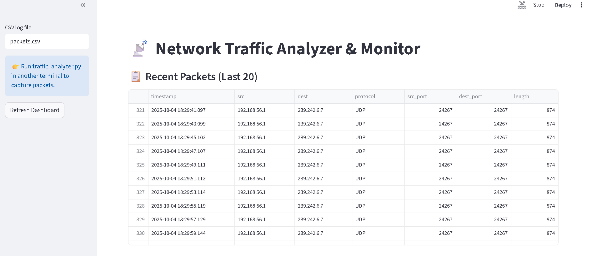
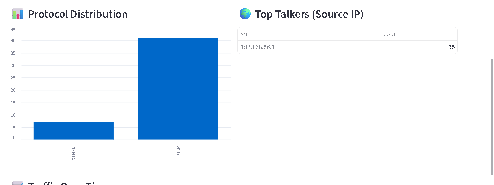
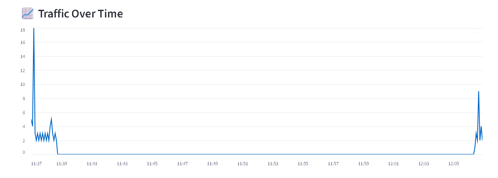

# Network Traffic Analyzer & Monitor

A simple tool to capture, analyze, and visualize network traffic using Python and Streamlit.  
Monitor live network packets, view protocol distribution, top talkers, and analyze traffic trends over time.

---

## 🚀 How It Works

1. **Capture Packets**
   - Run `traffic_analyzer.py` to start capturing packets from your network interface.
   - Ensure you set your Wi-Fi interface/IP configuration as required.

2. **Visualize Traffic**
   - Run `visualize_streamlit.py` in a separate terminal.
   - This opens a Streamlit dashboard in your browser for live monitoring.

---

## 🖥️ Screenshots

### 1. Dashboard Overview
Shows recent packets and a refresh option.  


### 2. Protocol Distribution & Top Talkers
Analyze protocol distribution and view top source IPs.  


### 3. Traffic Over Time
Observe traffic trends.  



---

## 📝 Setup

1. **Clone the repository**
   ```bash
   git clone https://github.com/Rahul554-commits/network-traffic-monitor.git
   cd network-traffic-monitor
   ```

2. **Install dependencies**
   ```bash
   pip install -r requirements.txt
   ```

3. **Configure your network interface**
   - Update the script or set your system IP as required for monitoring.

---

## ⚡ Usage

1. **Start Packet Capture**
   ```bash
   python traffic_analyzer.py
   ```
   - Builds or updates `packets.csv` with live packet data.

2. **Start the Dashboard**
   ```bash
   python visualize_streamlit.py
   ```
   - Opens the Streamlit dashboard in your browser.

---

## 📂 File Structure

| File                   | Purpose                        |
|------------------------|--------------------------------|
| traffic_analyzer.py    | Captures packets, logs to CSV  |
| visualize_streamlit.py | Launches dashboard UI          |
| packets.csv            | Stores packet data             |
| requirements.txt       | Python dependencies            |
| screenshots/           | UI screenshots                 |

---

## 🛠️ Features

- Live network packet capture
- Real-time dashboard refresh
- Protocol distribution charts
- Top source IP ("top talker") analysis
- Traffic trends visualization

---

## 📸 Screenshot Placement

Place UI images in the `screenshots/` directory:
- `screenshots/1.png` — Dashboard Overview
- `screenshots/2.png` — Protocols & Top Talkers
- `screenshots/3.png` — Traffic Trends

---

## 📝 Notes

- Requires administrative privileges for packet capturing.
- Optimized for Linux/Mac; Windows setup may need extra configuration.
- Adjust firewall or permissions as needed for full monitoring.

---

## 📧 Contact

For questions or feedback, please open an issue or reach out via [Rahul554-commits on GitHub](https://github.com/Rahul554-commits).

---
